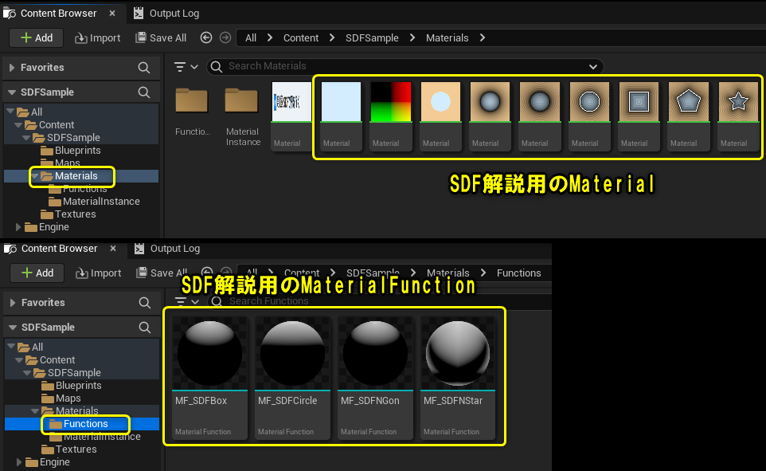

# SDFSample

技術書典17用の「SDFは☆を描く」のためのサンプルプロジェクトです。

「Materials」フォルダと「Functions」フォルダにSDFの解説に必要なアセットが配置されています。
Zenn側の画像で分からないことがあれば、中身を開いて確認してください。

| Assetの種類             | Path                                |
| ----------------------- | ----------------------------------- |
| SDF用のMaterial         | /Game/SDFSample/Materials |
| SDF用のMaterialFunction | /Game/SDFSample/Materials/Functions |

## 本の内容はZennで公開中

SDFを通してShaderを学習するための本を執筆しました。
プロジェクトのマテリアルの解説は以下のURLから読むことができます。

[📖技術書典17 SDFは☆を描く](https://zenn.dev/posita33/books/ue5_shader_book_001/viewer/chap_0c_00_00_index)
